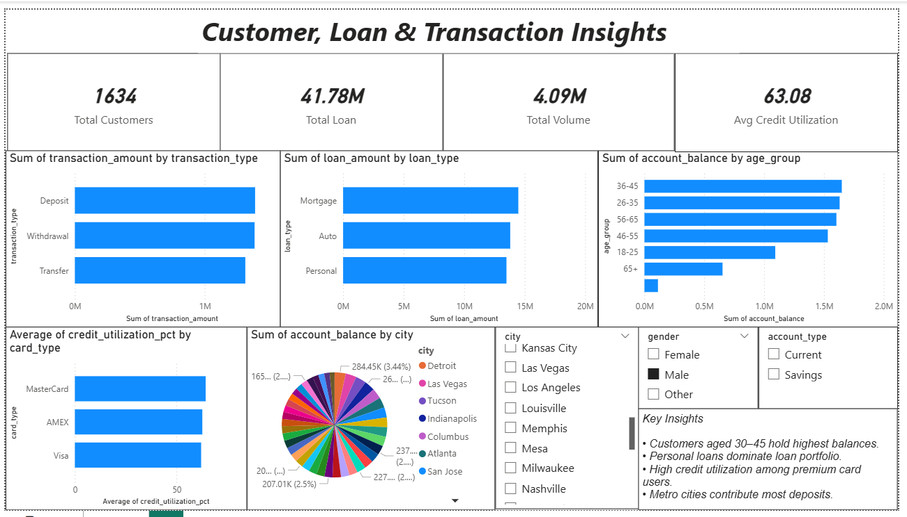

# 📊 Banking Operations Analytics Dashboard

## 🔹 Project Overview
This project focuses on analyzing banking customer data to uncover insights into transactions, loans, and credit behavior.  
The goal is to help banks make data-driven decisions and better understand customer financial patterns.

---

## 🔹 Objectives
- Analyze customer transactions and spending patterns  
- Study loan distribution and loan types  
- Evaluate credit utilization behavior  
- Identify high-value customers and regions  

---

## 🔹 Tools & Technologies Used
- Python (Pandas, NumPy)
- Matplotlib & Seaborn (EDA)
- Power BI (Dashboard)
- Jupyter Notebook

---

## 🔹 Dataset
The dataset contains banking customer information including:
- Customer demographics  
- Transaction details  
- Loan data  
- Credit card usage  
- Account balances  
- Anomaly indicators  

---

## 🔹 Data Cleaning Steps
- Removed duplicates  
- Handled missing values  
- Converted date columns to datetime  
- Created new features like:
  - Age Groups  
  - Credit Utilization %  
  - Transaction Year & Month  

---

## 🔹 Key KPIs
- Total Customers  
- Total Transactions  
- Total Loan Amount  
- Average Credit Utilization %  
- Total Anomalies  

---

## 🔹 Key Insights
- Customers aged 30–45 maintain the highest account balances  
- Personal loans form the largest share of total lending  
- High credit utilization observed among premium card users  
- Metro cities contribute the majority of deposits  
- Anomaly transactions indicate potential risk areas  

---

## 🔹 Dashboard Preview

---

## 🔹 Business Value
This dashboard helps banks:
- Identify high-value customers  
- Monitor credit risk  
- Optimize loan offerings  
- Track customer financial behavior  

---

---

## 🔹 Author
Prince Shakya  
Aspiring Data Analyst

